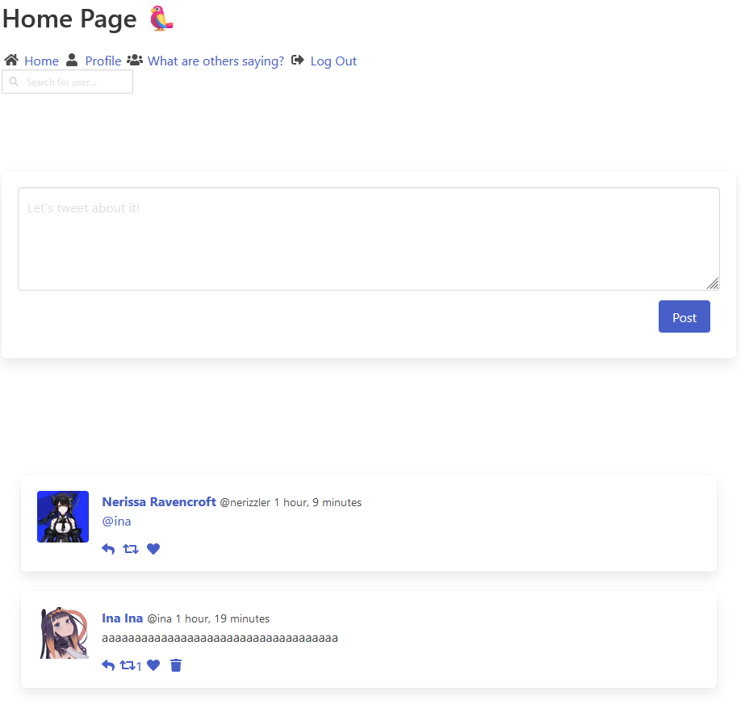

# Twitter (Django)

## Description
An application replicating core features of Twitter/X using the Django framework.

## Features
- Users can create an account on the Splash page
- Users can log into their account on the Splash page
- Users can log out
- Users can view their tweet feed on the Home page
- Users can post tweets, reply to tweets, retweet tweets, like tweets, and delete their own tweets
- Users can view their own profile on the Profile page
- Users can see their name, handle, profile picture, profile description, profile personal link, birthday, joined on date, followers, following, and their feed on the Profile page
- Users can edit their account settings on the Profile page
- Users can see all tweets on the "What are others saying" page
- Users can @ other users
- Users can post hashtags (#) in their tweets

## How to Run the Files
```
git clone project
cd twitter
python manage.py runserver
```

## Note
You might want to install Django on a virtual environment along with the other dependencies in requirements.txt

## Technologies
- Django
- Bulma

## Pictures



